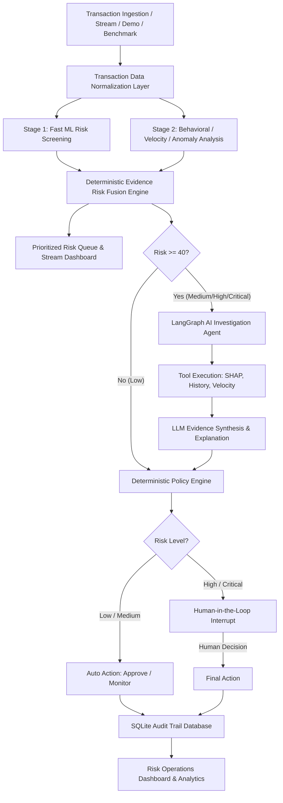

# RiskGuard-AI 🛡️
> **Autonomous AI Transaction-Risk Management Platform**  
> *Built for the Razorpay AI Buildathon 2026*

RiskGuard-AI is an intelligent, defense-only financial transaction risk monitoring and investigation platform. It combines high-throughput machine learning risk scoring, customer behavioral pattern analysis, transaction velocity tracking, statistical anomaly detection, SHAP explainability, autonomous LangGraph investigation agents, deterministic policy controls, human-in-the-loop (HITL) review, and persistent SQLite audit logging.

---

## 🔒 Defense-Only Commitment

RiskGuard-AI is strictly a **defense-only fraud and risk management system**. It does **NOT** contain fraud generation, attack vectors, evasion automation, payment exploitation, or vulnerability probing tools. Its sole purpose is to detect, investigate, prevent, monitor, and audit suspicious transaction activity.

---

## 🏛 System Architecture



---

## 🌟 Key Features

1. **Edge-Case Resilience & Missing History Handling**:
   - Gracefully handles new customers (`insufficient_history`), single-transaction customers, new devices, and unseen locations without raising exceptions. Missing history is reported as an information limitation, not automatically flagged as fraud.

2. **Unified Data Architecture**:
   - Manages both **Demo Fixtures** (`TXN1001`–`TXN1009`) for deterministic presentation scenarios and the **Public Fraud Benchmark Dataset** (`BENCH-000001`–`BENCH-284807`) for large-scale evaluation.

3. **Stage 1 Fast ML Screening & Prioritization**:
   - Vectorized XGBoost inference capable of screening >2,500 transactions per second.

4. **Multi-Signal Risk Fusion Engine**:
   - Deterministic evidence fusion formula combining ML probability, Behavioral score, Velocity surge score, Anomaly score, and Evidence Completeness ratios into an authoritative risk score (0–100) and risk level (`LOW`, `MEDIUM`, `HIGH`, `CRITICAL`).

5. **Autonomous LangGraph Agent & Grounded Tools**:
   - Tool-backed investigation agent (`get_transaction`, `get_customer_history`, `get_device_history`, `calculate_velocity_risk`, `get_customer_profile`, `get_device_profile`, `calculate_behavioral_risk`, `calculate_real_ml_risk`, `get_shap_explanation`).

6. **Human-in-the-Loop (HITL) Workflow**:
   - LangGraph `interrupt()` safety pauses `HIGH` and `CRITICAL` transactions for analyst approval (`APPROVE` or `REJECT`) with idempotent database audit logging.

7. **Persistent SQLite Audit Trail**:
   - Chronological logging of all system state transitions, risk calculations, policy decisions, and human actions.

8. **Risk Operations Center Dashboard (Streamlit)**:
   - 10 dedicated operational views: Overview, Live Stream Replay, Risk Explorer, Risk Queue, Batch Analysis, Model Performance, SHAP Explainability, Audit Trail, System Health, and a 5-Minute Guided Demo script.

---

## 📊 Dataset & Model Transparency

> [!NOTE]
> The **Public Credit Card Fraud Benchmark Dataset** (`data/real/creditcard.csv`) containing 284,807 transactions is used for model evaluation and batch scale testing. Feature columns `V1`–`V28` are anonymized principal components resulting from PCA transformation. RiskGuard-AI does **NOT** fabricate synthetic business meanings for `V1`–`V28`.

### Benchmark Model Metrics (Held-Out Test Set: 56,962 transactions)
- **Precision**: 87.50%
- **Recall**: 79.59%
- **F1 Score**: 83.33%
- **PR-AUC**: 85.21% (Imbalanced Fraud Benchmark Metric)
- **ROC-AUC**: 97.41%
- **False Positive Rate**: 0.0158%

---

## 🚀 Quickstart & Local Setup

### 1. Prerequisites
- Python 3.10+
- Virtual Environment (`venv`)

### 2. Environment Configuration
Ensure `.env` contains your Groq API Key:
```env
GROQ_API_KEY=your_groq_api_key_here
```

### 3. Run Automated Tests
```powershell
.\venv\Scripts\python.exe -m unittest discover -s tests
```

### 4. Start Risk Operations Center Dashboard
```powershell
.\venv\Scripts\python.exe -m streamlit run app.py
```

---

## 🎯 5-Minute Demonstration Guide

1. **0:00–0:45 | Overview**: Present defense-only architecture, key metrics, and core pipeline.
2. **0:45–1:45 | Stream & Scale**: Launch **▶ Live Transaction Stream** and screen 1,000 transactions in **⚡ Batch Analysis** (>2,500 tx/sec).
3. **1:45–2:45 | Deep Investigation**: Search `TXN1005` in **🔎 Risk Explorer** to demonstrate graceful `insufficient_history` handling, then search `TXN1009` for AI investigation.
4. **2:45–3:45 | Human-in-the-Loop**: Record analyst decision (**APPROVE** / **REJECT**) and inspect the persistent timeline in **📜 Audit Trail**.
5. **3:45–5:00 | Model Metrics**: Showcase precision, recall, PR-AUC, confusion matrix, threshold tuning, and cost modeling in **📊 Model Performance**.

---

## 📄 License & Disclaimers
This project was developed for the Razorpay AI Buildathon 2026. All benchmark data is public historical research data.
